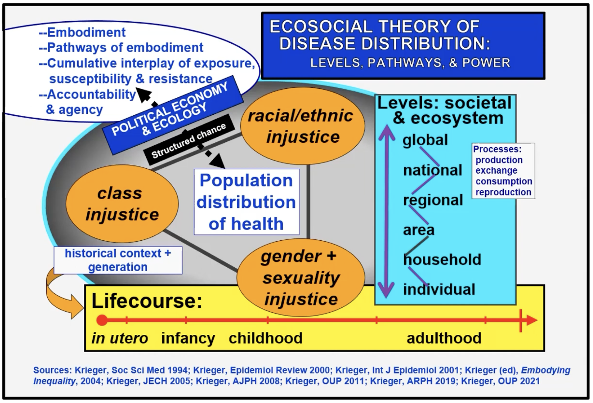

# Practicing TikZ 

Recently I've had something of an obsession with the TikZ figure rendering system that comes with $\LaTeX$. 
To better focus my learning and practice, I thought I'd work on recreating a relatively complicated figure that
was originally done in PowerPoint. 

While I think I'd make different stylistic or design choices, my thinking is that if I can replicate this figure's style,
that's good practice towards being able to replicate other styles in general. 

### The Original Figure 

### The TikZ Rendering 

### Lessons Learned Along The Way

... 

### References 

